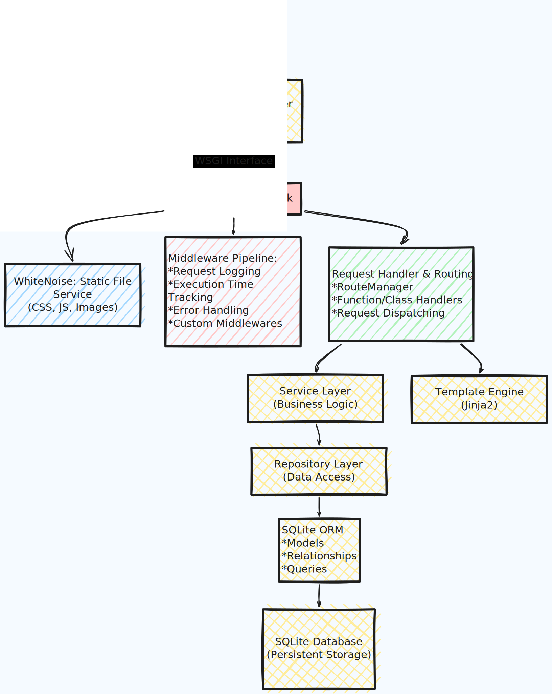
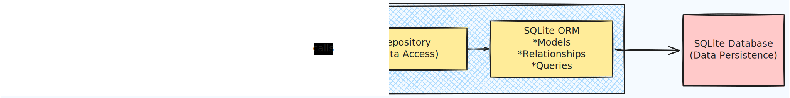
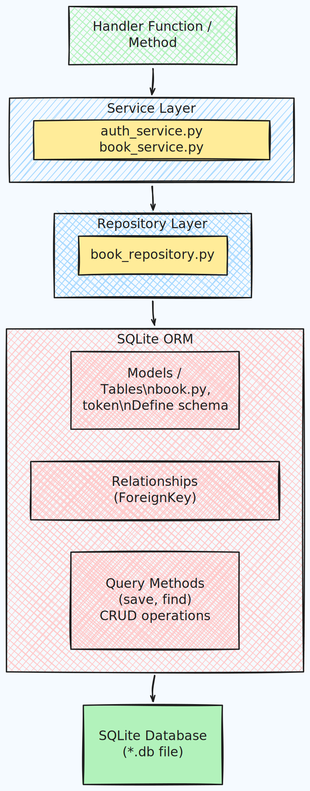

# Mahi WSGI Web Framework

A lightweight Python web framework built from scratch using WSGI specifications. This framework demonstrates core web framework concepts including routing, middleware, templating, ORM, and request-response handling. It's designed for learning purposes and simple web applications.

## Overview

This project is a complete implementation of a web framework written in pure Python. It includes a functional ORM for SQLite databases, a solid routing system, middleware support, template rendering with Jinja2, and static file serving. Several demo applications showcase how to use the framework effectively.

## System Architecture

The framework is organized into distinct layers that work together seamlessly:



## Component Interaction



## Features

- WSGI compliant application (works with Gunicorn, uWSGI, etc.)
- Dynamic routing with support for both class-based and function-based handlers
- Built-in ORM for SQLite with support for models, relationships, and migrations
- Middleware pipeline architecture
- Jinja2 template engine support
- Static file serving with WhiteNoise
- Exception handling
- Request/Response logging
- Execution time tracking

## Installation

To install the framework as a package:

```bash
pip install mahi-wsgi-web-framework
```

Or install from source:

```bash
pip install -r requirements.txt
python setup.py install
```

## Quick Start

### 1. Create a Simple Application

Create your application by instantiating the framework:

```python
from mahi_wsgi_web_framework import wsgi_framework

app = wsgi_framework(template_dir='templates', static_dir='static')
```

### 2. Define Routes

You can use decorators to define routes in your application:

```python
from webob.response import Response

@app.route('/hello')
def hello(request):
    return Response(body='<h1>Hello, World!</h1>')

@app.route('/users/<int:user_id>')
def get_user(request):
    user_id = request.matchdict['user_id']
    return Response(body=f'<h1>User {user_id}</h1>')
```

### 3. Add Middlewares

Attach middleware to handle cross-cutting concerns:

```python
from mahi_wsgi_web_framework.middlewares import (
    ReqResLoggingMiddleware,
    ExecTimeMiddleware,
    ErrorHandlerMiddleware
)

app.add_middleware(ReqResLoggingMiddleware)
app.add_middleware(ExecTimeMiddleware)
app.add_middleware(ErrorHandlerMiddleware)
```

### 4. Use Templates

Render dynamic content using Jinja2:

```python
@app.route('/dashboard')
def dashboard(request):
    context = {'name': 'John', 'title': 'Dashboard'}
    html = app.template('dashboard.html', context=context)
    return Response(body=html)
```

### 5. Work with Models (ORM)

Define models using the ORM:

```python
from mahi_wsgi_web_framework.orm import Table, Column, PrimaryKey

class User(Table):
    id = PrimaryKey(int)
    name = Column(str)
    email = Column(str)
```

### 6. Run Your Application

Use the built-in development server:

```bash
python app/wsgi_main.py
```

The server will start at http://localhost:8000

## Running with Gunicorn

For production or more robust development, use Gunicorn as the WSGI application server:

```bash
gunicorn App.main:app --reload --bind=localhost:8000
```

This command:
- Loads the application from `App/main.py` 
- Enables auto-reload when code changes
- Binds to localhost:8000

You can also customize the number of workers and other Gunicorn options:

```bash
gunicorn App.main:app --workers=4 --bind=0.0.0.0:8000
```

Gunicorn is already included in the requirements.txt dependencies.

## How the Framework Processes Requests

When a client makes an HTTP request to your application, here's what happens:

1. **Gunicorn receives the request** on localhost:8000
2. **WhiteNoise checks** if it's a static file (CSS, JS, images)
   - If yes → serves the file directly and returns
   - If no → continues to middleware pipeline
3. **Middleware Pipeline** processes the request:
   - Request logging middleware records incoming request
   - Execution time middleware starts the timer
   - Error handling middleware wraps the handler
   - Custom middlewares (Auth, Tokens, etc.) run
4. **Router dispatches** the request to the matching handler
5. **Handler (your code)** processes the request:
   - Can call services for business logic
   - Services can call repositories for data access
   - Repositories use the ORM to query the database
6. **Response creation** (options):
   - Render HTML using Jinja2 templates
   - Return JSON response
   - Return plain text response
7. **Middleware Pipeline (reverse)** processes the response:
   - Response middlewares run in reverse order
   - Execution time is logged
   - Response is logged
8. **Response is sent** back to the client with proper headers and status code

## Core Concepts

### Routing

Define routes using decorators:
```python
@app.route('/users/<int:user_id>')
def get_user(request):
    return Response(body=f'User {user_id}')
```

The framework supports dynamic URL parameters with type conversion (int, str, etc).

### Handlers

Handlers receive a WebOb Request object and must return a Response object:
```python
def my_handler(request):
    # Access request data
    method = request.method
    path = request.path
    params = request.GET
    post_data = request.POST
    headers = request.headers
    
    # Return response
    return Response(body='Hello World', status=200)
```

### Models

Define data models using the ORM:
```python
class Book(Table):
    id = PrimaryKey(int)
    title = Column(str)
    author = Column(str)
    isbn = Column(str)
```

### Services

Encapsulate business logic in service classes:
```python
class BookService:
    @staticmethod
    def get_all_books():
        return BookRepository.find_all()
    
    @staticmethod
    def create_book(title, author, isbn):
        book = Book(title=title, author=author, isbn=isbn)
        return BookRepository.save(book)
```

### Templates

Use Jinja2 to render dynamic HTML:
```html
<!-- templates/book.html -->
<h1>{{ book.title }}</h1>
<p>by {{ book.author }}</p>
<p>ISBN: {{ book.isbn }}</p>
```

In your handler:
```python
html = app.template('book.html', context={'book': book_obj})
return Response(body=html)
```

## Project Structure

```
mahi_wsgi_web_framework/          # Core framework package
  ├── framework.py                # Main application class
  ├── routing_manager.py          # URL routing logic
  ├── middlewares.py              # Middleware base classes
  ├── models.py                   # Base model utilities
  ├── helpers.py                  # Helper functions
  ├── logger.py                   # Logging utilities
  ├── orm/                        # Object-relational mapping
  │   └── sqlite_orm.py          # SQLite ORM implementation
  └── utils/                      # Utility modules

App/                              # Demo application
  ├── __init__.py                # App factory
  ├── main.py                    # Route definitions
  ├── wsgi_main.py               # WSGI entry point
  ├── api/                       # API controllers
  ├── view/                      # Template controllers
  ├── service/                   # Business logic
  ├── models/                    # Data models
  ├── repository/                # Data access layer
  ├── templates/                 # HTML templates
  └── static/                    # CSS, JS, images

tests/                            # Test suite
  ├── test_routing.py            # Routing tests
  ├── test_middlewares.py        # Middleware tests
  ├── test_orm/                  # ORM tests
  └── test_orm/test_sqlite_orm.py
```

## Data Flow Architecture



## Working with the ORM

The framework includes a simple but functional ORM for SQLite databases. Here's how to use it:

```python
from mahi_wsgi_web_framework.orm.sqlite_orm import Database

# Initialize database
db = Database('app.db')

# Create table from model
db.create_table(User)

# Insert records
user = User(name='Alice', email='alice@example.com')
db.save(user)

# Query records
users = db.find_all(User)
user = db.find_by_id(User, 1)

# Update records
user.name = 'Bob'
db.save(user)

# Delete records
db.delete(User, 1)
```

## Running Tests

The project includes comprehensive test coverage:

```bash
# Run all tests
pytest

# Run with coverage
pytest --cov=mahi_wsgi_web_framework

# Run specific test file
pytest tests/test_routing_manager.py

# Run ORM tests
pytest tests/test_orm/test_sqlite_orm.py
```

## Demo Applications

The repository includes two demo applications in the `App` and `demo_app` directories. These demonstrate:

- Setting up the framework with templates and static files
- Creating API controllers with authentication
- Building template-based views
- Using middlewares for cross-cutting concerns
- Structuring a larger application

To run the demo:

```bash
python App/wsgi_main.py
```

Then visit http://localhost:8000 in your browser.

## Middleware

The framework provides built-in middleware for common tasks:

- **ReqResLoggingMiddleware**: Logs all incoming requests and outgoing responses
- **ExecTimeMiddleware**: Tracks and logs execution time
- **ErrorHandlerMiddleware**: Handles exceptions and returns proper error responses

Create custom middleware by extending the base Middleware class:

```python
from mahi_wsgi_web_framework.middlewares import Middleware

class CustomMiddleware(Middleware):
    def process(self, environ):
        # Process before request
        pass
    
    def process_response(self, response):
        # Process after response
        return response
```

## Exception Handling

Handle exceptions globally:

```python
def handle_errors(request, exception):
    return Response(
        body=f'<h1>Error: {str(exception)}</h1>',
        status=500
    )

app.add_exception_handler(handle_errors)
```

## Static Files

Static files (CSS, JavaScript, images) are served from the `static` directory. They're automatically served with WhiteNoise for optimal performance.

## Requirements

- Python 3.6 or higher
- WebOb
- Jinja2
- WhiteNoise
- Parse (for URL pattern matching)

See requirements.txt for complete list of dependencies.

## Development

To set up the development environment:

```bash
pip install -r requirements.txt
```

## License

See the LICENSE file for details.

## Author

Mahi Sarwar Anol

## Notes

This framework was built for educational purposes to understand web framework architecture and design patterns. While functional, it's recommended to use production-grade frameworks like Django or Flask for real-world applications.